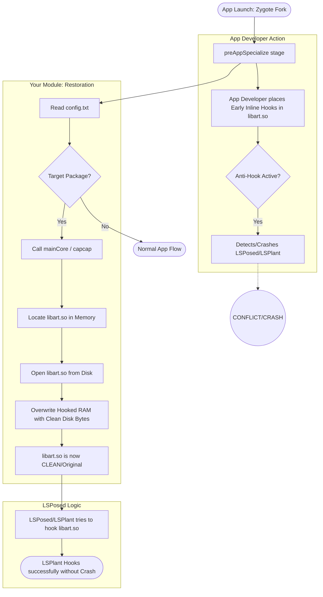

# Zygisk Invalidate Hooks

This module restores original library bytes from disk to memory to remove inline hooks inserted by App Developers to block Xposed/LSPosed.

## Why this is needed?
App developers often place early inline hooks in `libart.so` during the `preAppSpecialize` fork stage. When LSPosed which uses the **LSPlant** engine attempts to hook the same methods it conflicts with the developer's hooks

This module invalidates wipes out those early hooks by restoring clean bytes from the disk before LSPosed starts its work

## Process Flowchart

## Config Path
`/data/adb/modules/inline_hook_spoof/config.txt`

### Config Format:
`1:libart.so` (1 for enabled)  
`com.example.app` (package names line by line)
